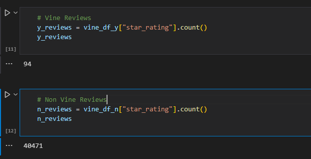
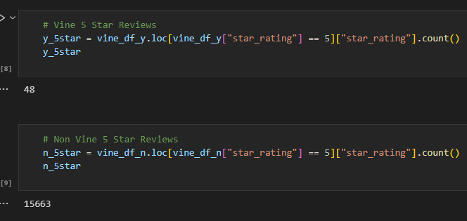
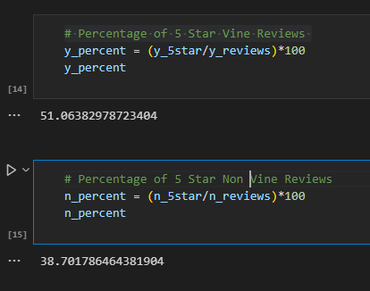

# Amazon Vine Analysis

## Overview

Amazon Vine is a program where manufacturing and publishers provide products to its' members then they are required to provide a review. We have been assigned a dataset from the Amazon Vine program which we will extract, transform then load into pgAdmin via Amazon Web Services. This data can then be used to see the differences between paid and non-paid reviews.

## Results: 

Comparison of total reviews

 
 
Comparison of 5 star reviews

 
 
Comparison of 5 star percentages

 

## Summary:

Based on the data from the table, the users of Vine have a positive bias when it comes to reviewing the products we have provided them. There is a 12 point difference between the vine users and the non-vine users which can be attributed to the compensation give to the vine users.  An addition analysis point that could be expanded upon is a comparison of the helpful votes between vine and nonvine users to see which reviews grant better advice when it comes to the product.
